<h1 style = 'display: flex; justify-content: center; gap:5px;'>
CUBOS FLIX

</h1>

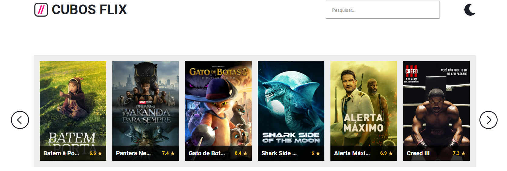

# Projeto em desenvolvimento

<h2 style= 'margin-bottom: 20px black '>Introdução</h2> 

CubosFlix é um projeto em  🚧 desenvolvimento 🚧👷🏼, alimentado por uma api de filmes, e que possui as seguintes funcionalidades: 

<ul>
<li> Visualização de filmes </li>
<li> Paginação de filmes </li>
<li> Busca de filmes </li>
<li> Filme do dia </li>
<li> Modal de filmes </li>
<li> Mudança de tema (claro/escuro)</li>
</ul>

## Para usar:
Como o projeto não está no ar, para usá-lo, você pode fazer uma cópia do repositório e rodar em seu computador.

## Visualização de filmes:
A aplicação possui um carrossel onde é exposto uma lista com 6 filmes, com imagem, nome e avaliação, abaixo é exposto o filme do dia, onde possui algumas informações à mais, como uma breve descrição do filme, categoria e data de lançamento.

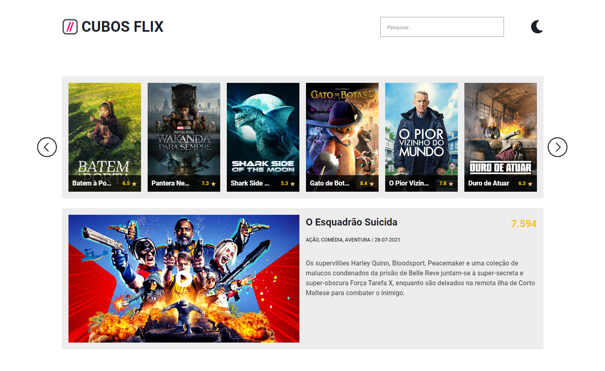

## Paginação de filmes:
É possível navegar no carrossel, a api oferece em média 20 filmes por vez, mas no projeto nós usamos 18. Para navegar, você pode usar as setas laterais, como nas imagens à seguir:

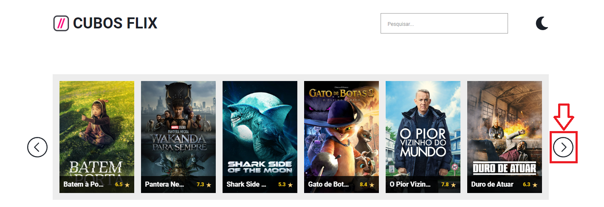
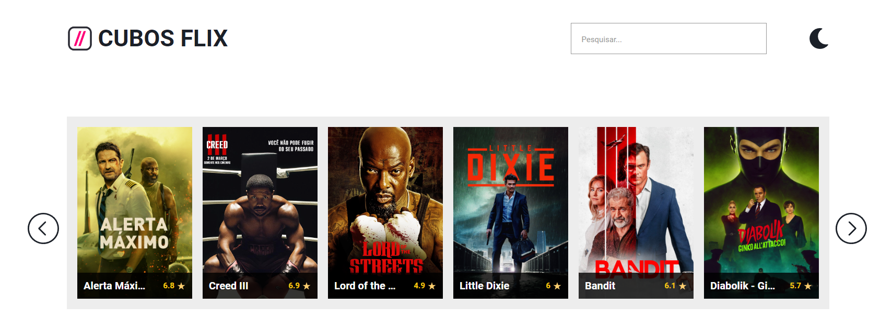

## Busca de filmes:
Através do pesquisar, é possível procurar por um filme específico de sua escolha.

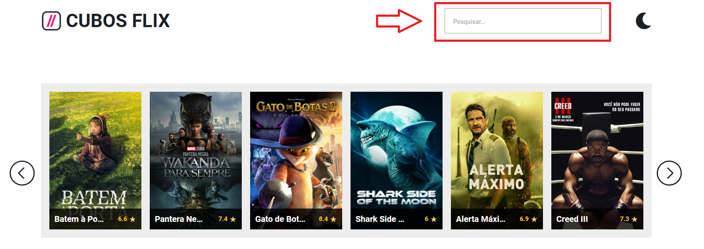
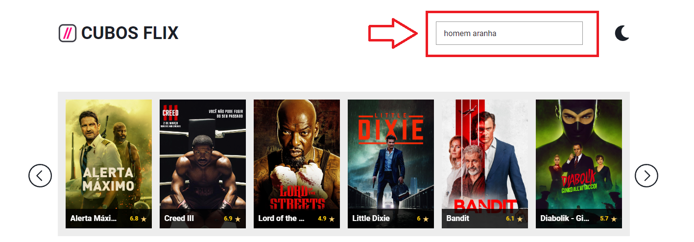
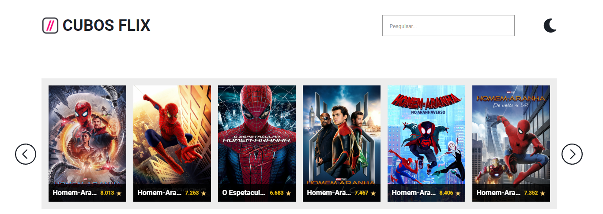

## Filme do dia:
O filme do dia é a sugestão da Cubos Flix, você pode clicar no play para ser encaminhado ao trailer do filme.
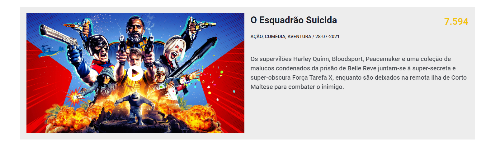

## Modal:
Você também pode clicar em um dos filmes para abrir o modal, com descrições mais detalhadas da sua escolha.

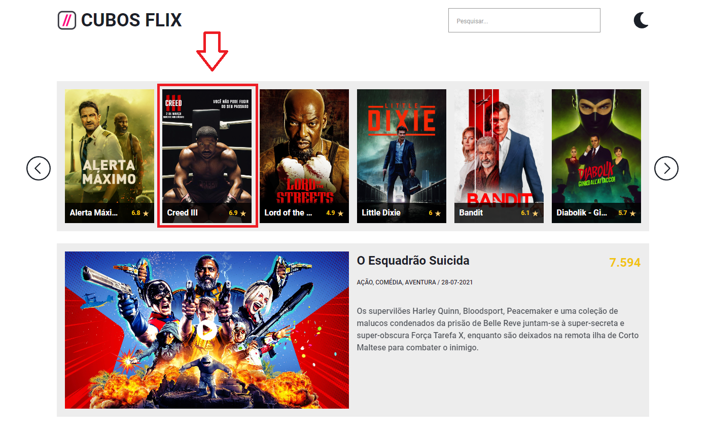
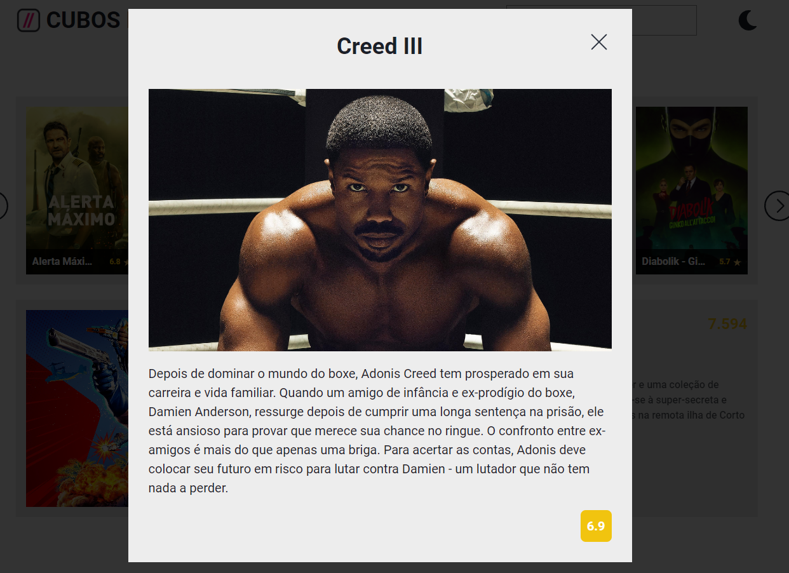

## Troca de tema (EM BREVE):
Será possível realizar a troca de tema, do claro para o escuro, ao selecionar o ícone do tema atual.
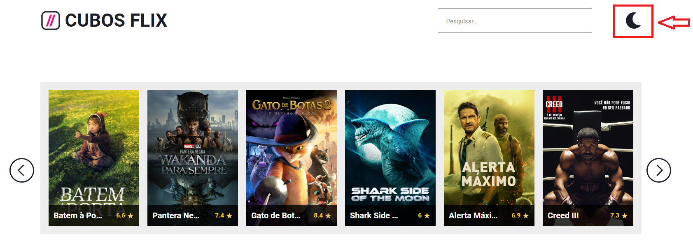

# Autor:
 [ Nicolau Matos](https://github.com/NicolauMatos)

###### tags: `front-end` `HTML` `DOM` `CSS`

